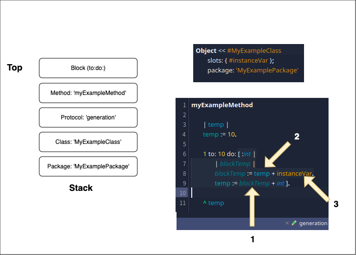
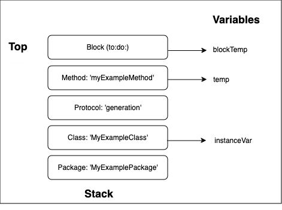

# User Documentation of the Symbol Resolver

A parsing helper to manage symbol resolution by handling scope resolution and finding the right entity from symbols in parsers
<!-- TOC -->

- [User Documentation of the Symbol Resolver](#user-documentation-of-the-symbol-resolver)
  - [Getting started](#getting-started)
  - [Manage your scopes](#manage-your-scopes)
    - [Understanding the importance of scopes](#understanding-the-importance-of-scopes)
    - [Manage your scopes with the `SymbolResolver`](#manage-your-scopes-with-the-symbolresolver)
  - [Register symbols to resolve](#register-symbols-to-resolve)
  - [Solvers](#solvers)
    - [Existing solvers](#existing-solvers)
    - [Add you own solver](#add-you-own-solver)
  - [Error repport](#error-repport)
  - [Aliases](#aliases)
  - [Advance cases](#advance-cases)
    - [Concept of Main Entity](#concept-of-main-entity)

<!-- /TOC -->
<!-- /TOC -->
<!-- /TOC -->
<!-- /TOC -->

This documentation is still a WIP. I'll add parts when I get the time little by little

## Getting started

The main goal of the symbol resolver is to simplify the symbol resolution during the development of a parser. 

A classic architecture for the development of a parser to build a model is to:
- Define a grammar and a paser for this grammar 
- Generate a pseudo AST matching the grammar and produce it via the parser
- Visit a first time this AST to build all entities of the model
- Visit a second time this AST to build all relations between entities of the model (We need a second pass because we need to ensure that all entities are created before we resolve links between them)

> [!NOTE]
> Since this is a documentation of `Symbol Resolver`, lets defined what is a `Symbol`. A `Symbol` in the scope of this documentation is a dependency to resolve during the parsing. We call that a symbol because before the resolution we only have the name of the entity we depend on (this name or path is what we call a `Symbol`) and then the resolver is using this name and the context in which this symbols is defined to find the real entity related to this name.

This project aims to simplify this last step. With this project you need only one visitor. Instead of doing a second visit, we can register symbols to resolve during the first visit, `SRSymbolsResolver` will register them with a copy of the scopes and we are able to resolve all of them at the end when all entities to resolve are created.

> [!NOTE]
> In the following documentation I'll use the Moose Python parser to give examples of usage of SymbolResolver

The first step to get started is to make the visitor use the trait `SRTSolverUserVisitor`:

```st
PyRootNodeVisitor << #FamixPythonImporterVisitor
	traits: {SRTSolverUserVisitor};
	slots: { #model . #rootFilePath };
	tag: 'Visitors';
	package: 'Famix-Python-Importer'
```

Then we need to call `#initializeSolver` in the initialization of the visitor:

```st
FamixPythonImporterVisitor>>initialize

	super initialize.
	model := FamixPythonModel named: 'Default Python Model'. "This will be updated later"
	self initialiseSolver 
```

Once this is done, we are be able to build a scope stack during the visit (See [Manage your scopes](#manage-your-scopes)) and we can register symbols to resolve (See section [Register symbols to resolve](#register-symbols-to-resolve)).

Then at the end of the visit you can call `#resolveUnresolvedSymbols` in order to launch the resolution of all registered symbols.

```st
visitor resolveUnresolvedSymbols
```

> [!TIP]
> The symbol resolution comes by default with a safe guard against errors to not make the full symbol resolution fail. For more info check section [Error repport](#error-repport)

## Manage your scopes

One important part of the symbol resolution is to know the scope on the symbol to resolve. In order to manage this, we are saving a stack of the scopes. 

### Understanding the importance of scopes

To make it easier to understand the principles, let's take an example with some Pharo code:



We can see in this example that we are parsing the method `#myExampleMethod` that is in a protocol `generation`, in a class named `MyExampleClass` in a package named `MyExamplePackage`.

The class has an instance variable named `instanceVar`. The method has a temporary named `temp` and a block with a temporary named `blockTemp`.

Now lets imagine we want to resolve the accesses 1, 2 and 3 on this example. In order to do that, we need to know the context of those accesses because it is possible that we do not have only one variable named `blockTemp` or `temp` or `instanceVar` in our project to parse and we need to find the right ones. This context is the stack on the left. We know that we are in a block, that is in `myExampleMethod` that is in the `generation` protocol, that is in the `MyExampleClass` class, that is en the `MyExamplePackage` package. From this, we have all the informations we need to resolve our 3 variables.



1. Variable `blockTemp`

This variable is easy to resolve since it is defined in the top scope that is the block in which it is currently. We just have to ask the variables of this block and we have our real variable.

2. Variable `temp`

For this one, we start to look for the variables in our top scope: the block. We do not have any variable of this name defined here. So we will go lower in our stack and check the second scope: `#myExampleMethod`. Here we find a temporary variable named `temp`. Our second symbol is resolved.

3. Variable `instanceVar`

As for `temp` we start to look in the variables of the block but none match. We go down in the stack but we don't have any variable of this name in `#myExampleMethod`. Same for the 3rd element of the stack, the `generation` protocol since protocols do not have variables. We then get to the `MyExampleClass` class and here we find an instance variable of the right name. We can end our visit since we found the entity corresponding to our symbol.

### Manage your scopes with the `SymbolResolver`

It is important to build the scopes stack while visiting your AST in order to have a right symbol resolution. For this, `SRTSolverUserVisitor` and `SRSymbolsResolver` provides some API:

- `#currentEntity:` Pushes the parameter as top of the stack in the scopes and consider this entity as the current entity of the resolution
- `#pushEntityAsScope:` Pushes the parameter as top of the stack in the scopes but does not consider it as the current entity of the resolution
- `#currentEntity` Gets the current entity of the resolution (will return the first entity of the stack consider as a current entity)
- `#topScope` Gets the top of the scopes stack
- `#popScope` Pops the top of the scopes stack

Here is an example:

```st
visitClassDefinition: aClassDef

	| class |
	class := self ensureClass: aClassDef.

	self currentEntity: class.

	super visitClassDefinition: aClassDef.
	class methods do: [ :method | method parentType: self currentEntity ].

	self popScope.
	^ class
```

Some suggar is provided to manage most of the cases:
- `#useCurrentEntity:during:` allow to set the current entity for the execution of a block
- `#withCurrentEntityDo:` execute a block taking the current entity as a parameter. In case there is no entity in the scopes, do nothing
- `#currentEntityOfType:` gets the first current entity of a given type


Let's rewrite our previous example with this:

```st
visitClassDefinition: aClassDef

	^ self
        useCurrentEntity: (self ensureClass: aClassDef)
        during: [
            super visitClassDefinition: aClassDef.
            class methods do: [ :method | method parentType: self currentEntity ] ]
```

Now imagine we want to check if the current entity we have has already a module of a certain name. But it is possible we have no current entity. We can use this piece of code:

```st
ensureModuleNamed: moduleName fromNode: aModuleNode

	self withCurrentEntityDo: [ :entity |
		(entity query descendants ofType: FamixTModule)
			detect: [ :module | module name = moduleName ]
			ifFound: [ :module | ^ module ] ].

	^ self createModule: aModuleNode named: moduleName
```

This should let you build your scopes stack easily. The stack is useful for the symbol resolution but can also be useful during the visit to query the parents of the entities we are building.

## Register symbols to resolve

TODO

## Solvers 

TODO

### Existing solvers 

TODO

### Add you own solver

It is highly possible that for some cases it is required to implement a solver that is not yet present in SymbolResolver. For example, depending on the language, the import system might differ and you need one with specificities.

TODO - Add description on how to implement the Solver

The actual resolution should be implemented in the method `MyResolvable>>#resolveInScope:currentEntity:`. This method takes the current scope and the current entity as a parameter. 
The method will be called first in the top scope. In case the entity is not found, you should throw a `NotFound` error. In that case, the solver will catch this error and try in the next scope until there is no scope left to look into. If that's happening, then the replacement strategy will be triggered. 
In some cases it is also possible that we know that an entity will not be found in any scope left to search. In that case, it is possible to raise a `SRNoResolutionPossible` error instead of a `NotFound`. This will stop the resolution right away and delegate the resolution to the replacement strategy. This is an optimization.

## Error repport

In the development of a parser it is common to have edge cases that are hard to handle and to have crashes. This project provides a little utility to help handling such cases.

`SRParsingReport` is instanciated by the `SRSymbolsSolver` in the `errorReport` instance variable during its initialization. It can be used to add a safeguard during the execution of some code to catch errors or warnings without interruptiong the parsing.

For example it can be used during the visit of an AST with a visitor using `SRTSolverUserVisitor` like this:

```st
acceptNode: aNode

	^ self errorReport catch: Error during: [ super acceptNode: aNode ]
```

Or

```st
visit: aNode
	
	^ self errorReport catch: Error during: [ aNode acceptVisitor: self ]
```

This error report is also used during the symbol resolution directly in the method `SRSymbolsSolver>>#resolveUnresolvedSymbols`.

At the end of the pasring, we can inspect this error report to find the errors that happened during the parsing.

API:
- `SRParsingReport>>#catch:during:` allow to catch some errors or error set during the execution of a block
- `SRParsingReport>>#catch:during:isWarningIf:` same as above but wiht a way to configure what should be considered as a warning
- `SRParsingReport>>#catchWarningsDuring:` allow to catch and proceed on warnings during the execution of a block, but still raises errors

> [!TIP]
> While developping a parser it might be interesting to have an actual debugger instead of catching all the errors. It is possible to go in development mode via the world menu: `Debug > Toggle Symbol Resolver Debug mode`

## Aliases

TODO

## Advance cases

### Concept of Main Entity

TODO